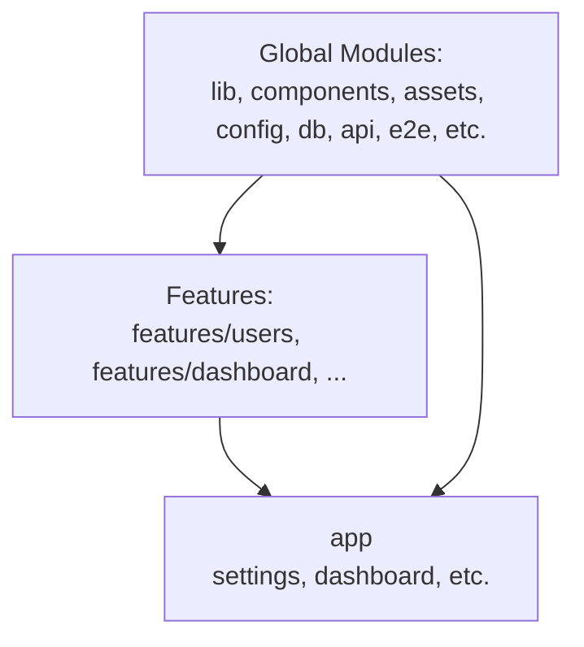

# Folder structure

## Details

- `app` - renders pages only  
  - All business logic and functionality must live outside of `/app`.  
  - `/app` should **only consume** modules from other folders.
- `assets` - provides global static content for use by the application and features.
- `e2e` - contains global end-to-end tests.
- `lib` - stores global utility functions and logic shared across the app and features.  
- `components` - houses global UI components used throughout the app and features.
- `config` - contains global constants and configuration.
- `db` - exposes global database functions.
- `api` - provides global API logic.
- ...
- `features`
  - `feature1` (e.g. Cart Page)
    - `lib` - logic specific to the feature.
    - `components` - feature-specific UI components.
    - `db` - data access specific to the feature.
    - `api` - API functions exposed only for the feature.
    - ...
  - `feature2` (e.g. Dashboard)
    - `lib`
    - `components`
    - `db`
    - `api`
    - ...

## Examples

Read `<-` as "imports"

1. `app` <- `lib` ✅
1. `lib` <- `features/dashboard/db` ❌
1. `features/dashboard/db` <- `lib` ✅
1. `app` <- `features/dashboard/components` ✅
1. `features/dashboard/components` <- `app` ❌
1. `components` <- `features/dashboard/components` ❌
1. `features/feature2/components` <- `components` ✅

## Compliance

This folder structure is enforced by the linter. Disregarding this will result in an error and fail CI.

## Why

1. As we develop a feature, each feature is guaranteed to be entirely indepent of _all of the other features_.
1. This one-way import flow reduces ciclical imports and separates concerns by feature.
1. Long term, this will significantly reduce complexity when adding new features or changing existing ones as you will not see inter-feature dependencies.
1. Causes developer to critically think about _what_ is being placed _where_. Only globally used functions should be placed in non-`features/*` folders.

## References

1. See Kyle Cook's [Youtube video](https://www.youtube.com/watch?v=xyxrB2Aa7KE&t=1s) detailing this exact folder structure and why it is extremely useful in large codebases.

1. Example product [source code](https://github.com/WebDevSimplified/parity-deals-clone/tree/feature-folder-structure)
